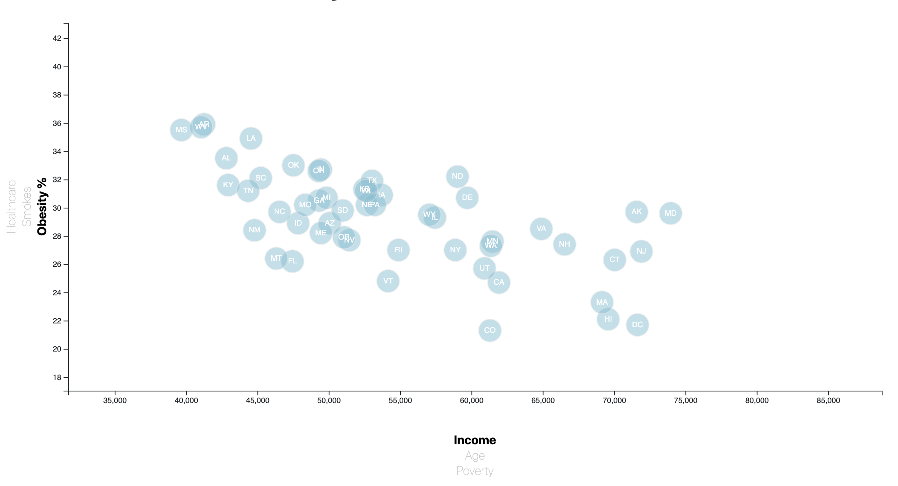

# Health Risk Factor Analysis

## Summary: 
I analyzed the poverty, age, or household income in relation to to obesity, smoking, and lack of healthcare by making an interactive graph that let's the user explore different factor combinations.  

The data set included with the assignment is based on 2014 ACS 1-year estimates: https://factfinder.census.gov/faces/nav/jsf/pages/searchresults.xhtml

## Display 
[Webpage Analysis](https://kasiakalemba.github.io/Health-Risk-Factors/)

## Technologies
* Javascript: D3
* HTML, Boostrap, CSS

## Development
I created a scatter plot between two of the data variables such as Healthcare vs. Poverty or Smokers vs. Age. By Using the D3 techniques, I created a scatter plot that represents each state with circle elements. I placed additional labels in the scatter plot and gave them click events so that your users can decide which data to display. I included animated transitions for the circles' locations as well as the range of the axes and added tooltips to circles with the data that the user has selected. 

## Usage 
* Clone the repository 
* Ryn python -m http.server to run the visualization. This will host the page at local host in your web browser. 

## Observations
The most apparent trends seems to be related to income. The higher the income, the less uninsured people in the corresponsing state as well as lower smoking and obesity levels. As poverty % increases in a given state, those same factors have the opposite trend. The results are expected as states with higher income generally have more resources to keep their populations healthier. 

Southern states displayed the strongest correlations between observed correlations such as increased smoking and obesity. 

